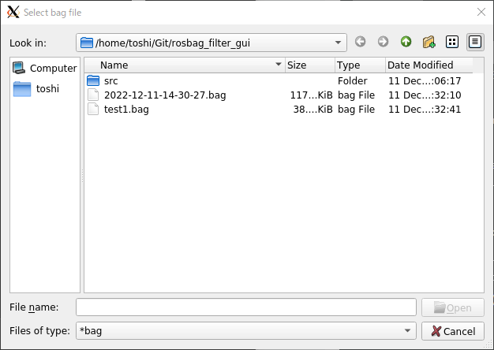
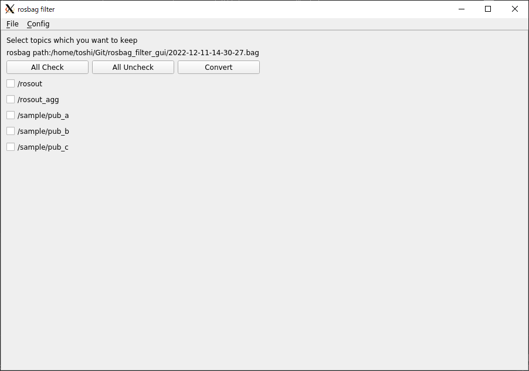
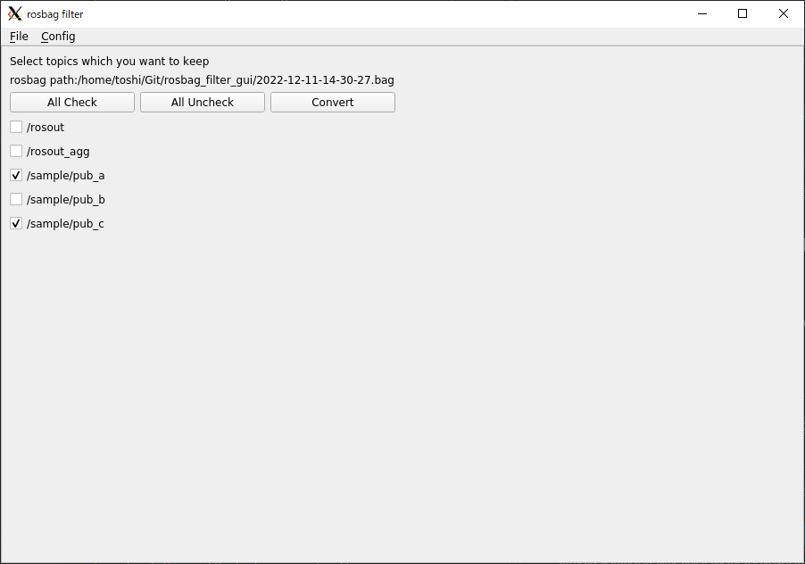
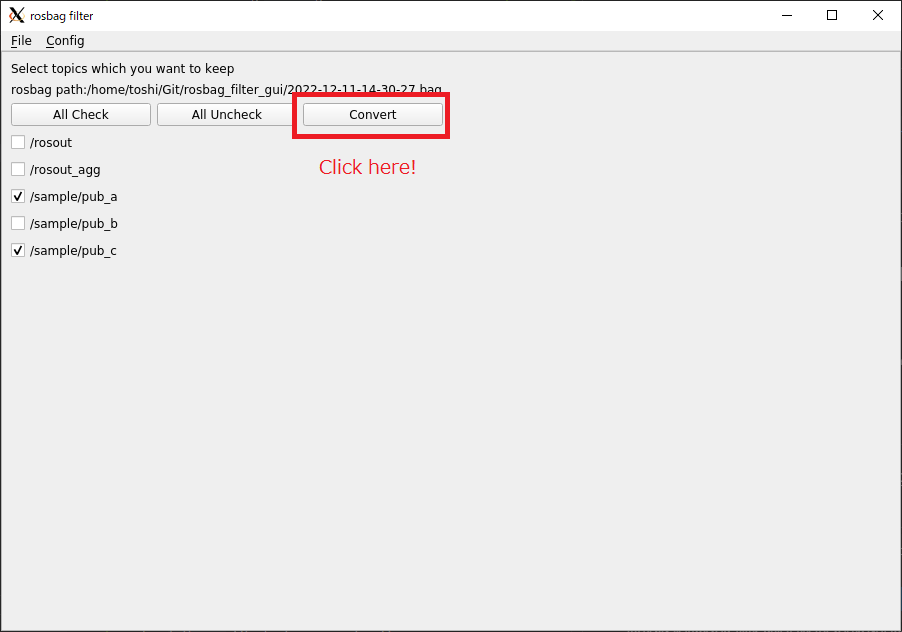
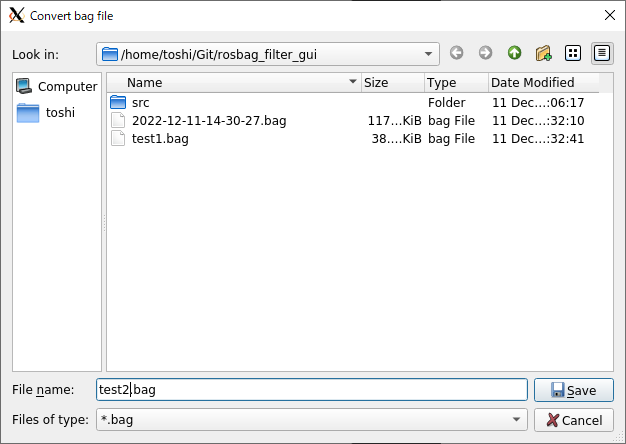
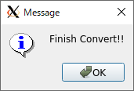
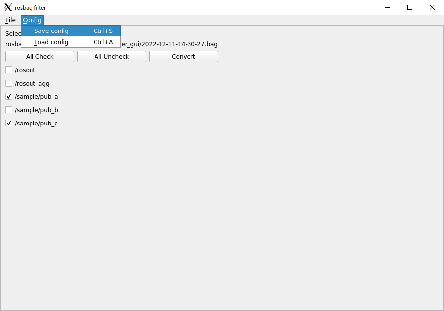
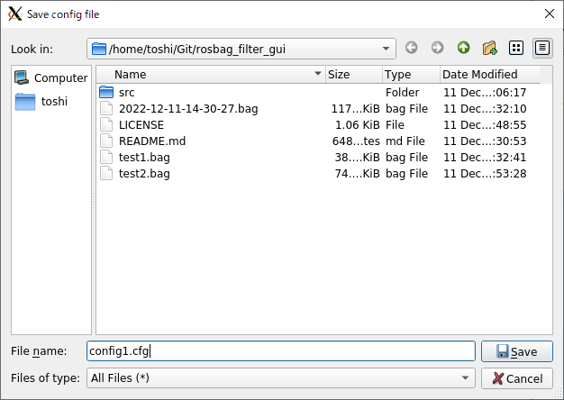
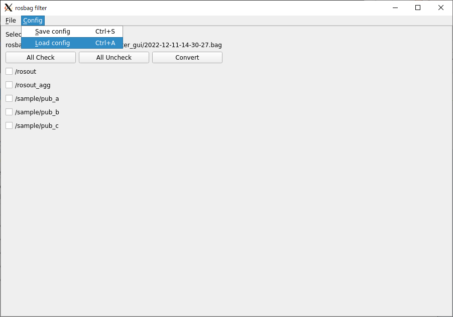
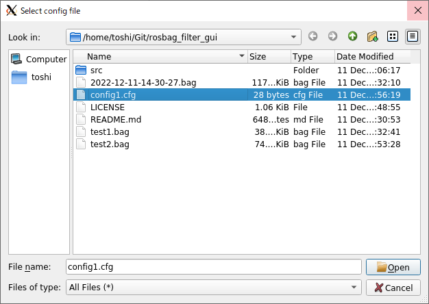

# rosbag_filter_gui
A GUI rosbag filtering tool for python3.  
Improving [AtsushiSakai/rosbag_filter_gui](https://github.com/AtsushiSakai/rosbag_filter_gui) tool as python3. And adding some functions.

# How to use
## 1. Clone this package

> git clone https://github.com/tosiyuki/rosbag_filter_gui

## 2. Run the script
> python src/MainWindow.py

## 3. Select a bag file which you want to filter

load rosbag file

## 4. Select topics with checkbox, which you want to keep

## 5. Execute filtering

Click Convert button

Select saving file name and click save and wait a second...

## 6. finish convert
when finish convert, popup appear

# Other function

## 1. save and load select topics setting

Since it is difficult to select a check box every time, there is a feature to record which topics have been checked.

### Save config

Click Config -> Save Config

Select saving config file name

### Load Config

Click Config -> Load Config

Select loading config file name

selected topicks are checked

# License
MIT

# Acknowledgment
[AtsushiSakai/rosbag_filter_gui](https://github.com/AtsushiSakai/rosbag_filter_gui): A PyQT4-based GUI tool for rosbag filtering